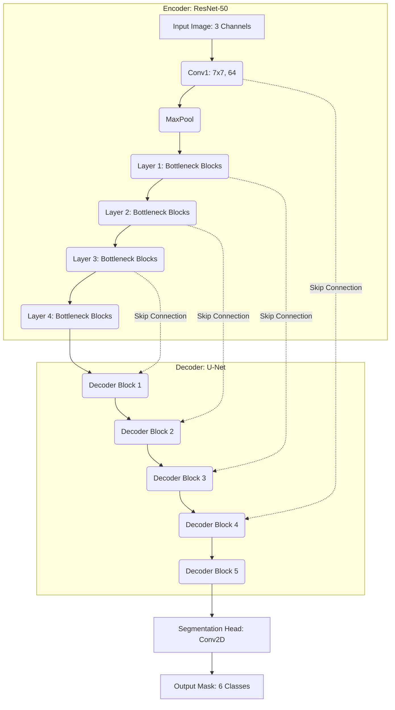

# Geospatial Semantic Segmentation

This repository contains the training pipeline and experimental setup for semantic segmentation of satellite imagery. The goal is to classify each pixel into one of 6 distinct land-cover classes using state-of-the-art Deep Learning models.

## 🚀 Overview

The project uses the `segmentation-models-pytorch` library to build and train a **U-Net** architecture with a robust **ResNet-50** backbone. 
The pipeline includes data loading, augmentation (using `albumentations`), and reading satellite imagery via `rasterio` and `OpenCV`.

## 🧠 Model Architecture

The segmentation network employs a **U-Net** structure, heavily relying on a pre-trained **ResNet-50** encoder to extract dense spatial features from satellite images.




### Key Components:
- **Encoder (ResNet-50)**: Uses weights pre-trained on ImageNet to extract robust hierarchical features (edges, textures, object parts).
- **Decoder**: A standard U-Net decoder that progressively upsamples the feature maps.
- **Skip Connections**: Connect the encoder stages directly to their corresponding decoder stages to recover fine-grained spatial details lost during max-pooling.
- **Output Head**: A 1x1 Convolution layer mapping the final decoder features to the 6 target classes.

## ⚙️ Training Details

The notebook `train_model.ipynb` contains the full training pipeline with the following hyperparameters:
- **Loss Function**: Combined `DiceLoss` (multiclass) + `CrossEntropyLoss` to handle class imbalances and pixel-wise accuracy.
- **Optimizer**: `AdamW` (Adam with Weight Decay)
- **Batch Size**: 2
- **Epochs**: 80
- **Device**: PyTorch CUDA/CPU auto-detection

## 📂 Repository Contents
- `train_model.ipynb`: Jupyter notebook containing the full data loading, model definition, training loop, and evaluation logic.
- `feature_extraction_unet_resnet50.pth.zip`: The serialized weights of the fully trained model.

## 🛠️ Setup & Installation

To run the notebook, install the necessary dependencies:

```bash
pip install torch torchvision
pip install segmentation-models-pytorch
pip install albumentations
pip install rasterio
```
